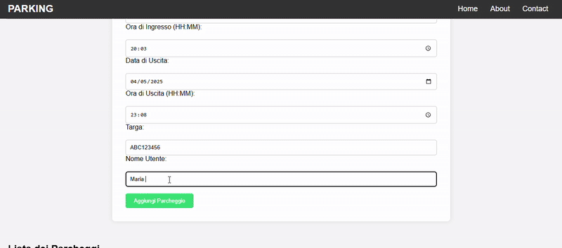

# Parcheggio - Sistema di Gestione Parcheggi 🚗

## Descrizione del progetto

🖼️ Project Overview


Benvenuto nel progetto **Sistema di Gestione Parcheggio**! 🎉 
Un'applicazione semplice e potente per gestire i parcheggi. Con questa soluzione, gli utenti possono registrare il loro ingresso e uscita dal parcheggio, vedere i dettagli e calcolare automaticamente il costo in base alla durata della sosta.

Il sistema è realizzato con **Java**, **Spring Boot**, **MySQL** e una **UI React** per l'interazione. L'applicazione salva i dati relativi ai parcheggi come la data/ora di ingresso, l'ora di uscita, la targa e il nome dell'utente, calcolando automaticamente la durata e il costo.

---



## 🚀 Funzionalità principali

- **Aggiungi Parcheggio**: Registrazione di un parcheggio con data e ora di ingresso e uscita.
- **Visualizza Parcheggi**: Vedere tutti i parcheggi registrati nel sistema.
- **Calcolo Costo Parcheggio**: Calcolo del costo in base alla durata della sosta (fino a 24 ore).

---

## 🛠 Tecnologie Utilizzate

- **Java**: Linguaggio di programmazione principale.
- **Spring Boot**: Framework per creare applicazioni Java moderne e sicure.
- **MySQL**: Database relazionale per archiviare i dati dei parcheggi.
- **React**: Libreria JavaScript per costruire l'interfaccia utente.
- **Axios**: Per fare richieste HTTP dal front-end React al back-end Spring Boot.

---


## 🎯 Come far partire il progetto

### 1. Clonare il Repository

Per iniziare, clona il repository nel tuo ambiente locale:

```bash
git clone https://github.com/tuo-utente/tuo-repository.git
cd tuo-repository

2. Configurare il Database
Crea un database in MySQL:


CREATE DATABASE parcheggio;
Importa il file SQL per creare la struttura del database:


mysql -u root -p parcheggio < backend/mysql/parcheggio2.sql
Configura i parametri di connessione nel file src/main/resources/application.properties:

properties

spring.datasource.url=jdbc:mysql://localhost:3306/parcheggio
spring.datasource.username=root
spring.datasource.password=tuo-password
spring.jpa.hibernate.ddl-auto=update
spring.datasource.driver-class-name=com.mysql.cj.jdbc.Driver
3. Avviare il Back-End (Spring Boot)
Naviga nella cartella backend:


cd backend
Installa le dipendenze utilizzando Maven:

ù
mvn clean install
Avvia il server:


mvn spring-boot:run
Il server sarà disponibile su http://localhost:8080.

4. Avviare il Front-End (React)
Naviga nella cartella frontend:


cd frontend
Installa le dipendenze:

ù
npm install
Avvia il front-end:

ù
npm start
Ora, puoi visitare http://localhost:3000 per vedere l'interfaccia utente.

🔧 Endpoints API
1. Aggiungi Parcheggio
Metodo: POST
URL: /parcheggio/aggiungi

Body della richiesta(puoi utilizzare POSTMAN per testare il Server):

json
{
  "dataIngresso": "2025-05-01",
  "oraIngresso": "10:30",
  "dataUscita": "2025-05-01",
  "oraUscita": "12:30",
  "targa": "AB123CD",
  "nomeUtente": "Mario Rossi"
}
Risposta:


{
  "id": 1,
  "dataIngresso": "2025-05-01",
  "oraIngresso": "10:30",
  "dataUscita": "2025-05-01",
  "oraUscita": "12:30",
  "targa": "AB123CD",
  "nomeUtente": "Mario Rossi",
  "durata": "120",
  "costo": 10
}
2. Visualizza tutti i Parcheggi
Metodo: GET
URL: /parcheggio/tutti

Risposta:

json

[
  {
    "id": 1,
    "dataIngresso": "2025-05-01",
    "oraIngresso": "10:30",
    "dataUscita": "2025-05-01",
    "oraUscita": "12:30",
    "targa": "AB123CD",
    "nomeUtente": "Mario Rossi",
    "durata": "120",
    "costo": 10
  }
]
🤝 Contribuire
Se vuoi contribuire a questo progetto, segui questi passaggi:

Forka il repository.

Crea una nuova branch per la tua funzionalità:

git checkout -b feature/aggiungi-nuova-funzionalità
Fai le tue modifiche e aggiungi i cambiamenti:


git commit -m "Aggiunta nuova funzionalità"
Pusha la tua branch e crea una pull request:


git push origin feature/aggiungi-nuova-funzionalità
📜 Licenza
Questo progetto è rilasciato sotto la licenza MIT. Vedi il file LICENSE per maggiori dettagli.

📌 Notes
Make sure you are running both the backend and frontend for the app to work properly.

If you're facing permission issues, try running commands as an Administrator.

📄 License
MIT License

Copyright (c) 2025 [Probyte5D]

Permission is hereby granted, free of charge, to any person obtaining a copy of this software and associated documentation files (the "Software"), to deal in the Software without restriction, including without limitation the rights to use, copy, modify, merge, publish, distribute, sublicense, and/or sell copies of the Software, and to permit persons to whom the Software is furnished to do so, subject to the following conditions:

The above copyright notice and this permission notice shall be included in all copies or substantial portions of the Software.

THE SOFTWARE IS PROVIDED "AS IS", WITHOUT WARRANTY OF ANY KIND, EXPRESS OR IMPLIED, INCLUDING BUT NOT LIMITED TO THE WARRANTIES OF MERCHANTABILITY, FITNESS FOR A PARTICULAR PURPOSE AND NONINFRINGEMENT. IN NO EVENT SHALL THE AUTHORS OR COPYRIGHT HOLDERS BE LIABLE FOR ANY CLAIM, DAMAGES OR OTHER LIABILITY, WHETHER IN AN ACTION OF CONTRACT, TORT OR OTHERWISE, ARISING FROM, OUT OF OR IN CONNECTION WITH THE SOFTWARE OR THE USE OR OTHER DEALINGS IN THE SOFTWARE.